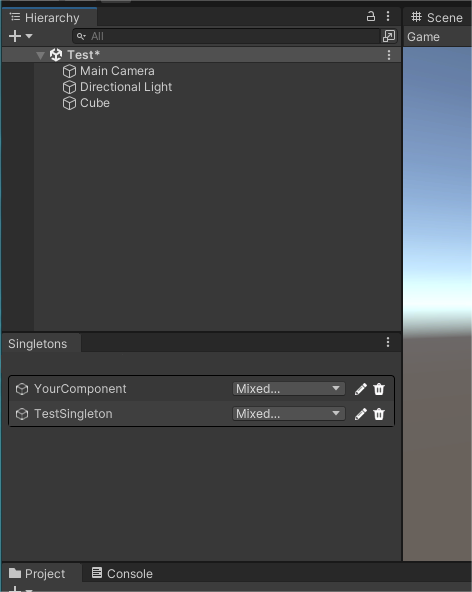

可以在Editor和Runtime混用的Unity单例模块。稳定可靠，懒加载，无额外开销，任何情况都不会出现多实例化。


## Features
* 兼容所有场景，稳定可靠的提供一个单例：
    * Editor和Runtime混合使用
    * 中途重新编译脚本
    * 不同的`Reload Domain`选项
    * 场景切换
    * etc
* 可以包含子物体：基于MonoBehaviour，可添加子GameObject
* 独立于场景：单例默认使用HideFlags隐藏，不属于任何场景，不需要考虑入口场景
* 可检索：可视化窗口检索单例列表（Window/bbbirder/Singletons）
## Example
只需要继承`Singleton<T>`
```csharp
using UnityEngine;
using com.bbbirder.unity;
public class YourComponent:Singleton<YourComponent>{
    protected override void Awake(){
        SayHello();
    }
    public void SayHello(){
        print("hello,world");
    }
}
```
需要调用的地方 ：
```csharp
    YourComponent.Instance.SayHello();
```
通过Window/bbbirder/Singletons窗口查看当前的单例


## Known Issues
~~1. 可视化窗口在部分低版本Unity中不自动刷新，需要手动改变下窗口大小解决。或者升级Unity版本~~
